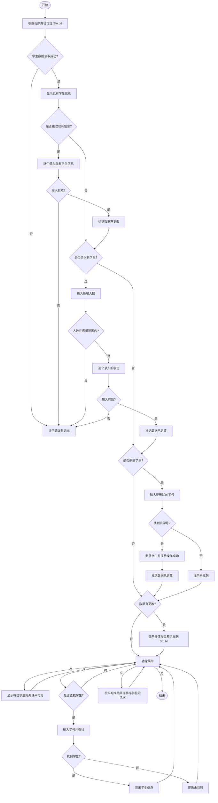

# Fucking-home-work
homework for free

```mermaid
flowchart TD
    S([开始]) --> P[根据程序路径定位 Stu.txt]
    P --> R{学生数据读取成功?}
    R -->|否| E[提示错误并退出]
    R -->|是| D[显示已有学生信息]

    D --> Q1{是否更改现有信息?}
    Q1 -->|是| EDIT[逐个录入现有学生信息]
    EDIT --> V1{输入有效?}
    V1 -->|否| E
    V1 -->|是| CH1[标记数据已更改]
    Q1 -->|否| Q2
    CH1 --> Q2{是否录入新学生?}

    Q2 -->|是| N[输入新增人数]
    N --> V2{人数在容量范围内?}
    V2 -->|否| E
    V2 -->|是| ADD[逐个录入新学生]
    ADD --> V3{输入有效?}
    V3 -->|否| E
    V3 -->|是| CH2[标记数据已更改]
    Q2 -->|否| Q3
    CH2 --> Q3{是否删除学生?}

    Q3 -->|是| ID[输入要删除的学号]
    ID --> FOUND{找到该学号?}
    FOUND -->|是| DEL[删除学生并提示操作成功]
    DEL --> CH3[标记数据已更改]
    FOUND -->|否| NF[提示未找到]
    Q3 -->|否| SAVEQ
    CH3 --> SAVEQ
    NF --> SAVEQ

    SAVEQ{数据有更改?}
    SAVEQ -->|是| SAVE[显示并保存完整名单到 Stu.txt]
    SAVEQ -->|否| MENU
    SAVE --> MENU

    MENU[功能菜单]
    MENU -->|A| AVG[显示每位学生的两课平均分]
    AVG --> MENU
    MENU -->|B| FINDQ{是否查找学生?}
    FINDQ -->|否| MENU
    FINDQ -->|是| FINDID[输入学号并查找]
    FINDID --> FOUND2{找到学生?}
    FOUND2 -->|是| SHOW[显示学生信息]
    FOUND2 -->|否| NF2[提示未找到]
    SHOW --> MENU
    NF2 --> MENU
    MENU -->|C| SORT[按平均成绩降序排序并显示名次]
    SORT --> MENU
    MENU -->|Q| END([结束])
```

